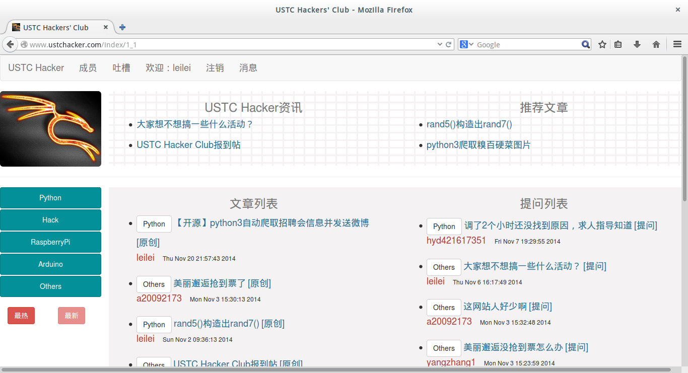

ustchacker.com
==============
###简介：
本站（[http://www.ustchacker.com](http://www.ustchacker.com)）是基于tornado和bootstrap的分类兴趣网站，提供用户注册、邮箱验证、发表文章、发表提问等功能。网站不断改进发展中，没有经过大力宣传，注册用户25+。现在开源出来，希望和大家共同改进，打造出一个分类兴趣网站的模板式框架！

###网站截图：

###依赖的库：
* [tornado](https://github.com/tornadoweb/tornado)
* [markdown2](https://github.com/trentm/python-markdown2)
* [sqlite3]
如果你使用的是ubuntu或者debian,你可以通过下边的方式安装以上库
<pre>
pip install tornade
pip install markdown2
apt-get install sqlite3
</pre>
或
<pre>
easyinstall tornado
easyinstall markdown2
apt-get install sqlite3
</pre>

####注意：
需要自己添加mailPassword.py文件，保证邮箱能正常登录,里面是：
<pre>
MAILPASSWORD = '[your mail password]'
</pre>

###下一步要做的：

1. 前端界面太过简陋，希望前端爱好能pull出自己的一份力，我会积极联系并merge到主站哒:-)
2. SQLite改为Redis，提高并发性能，这个我来搞

